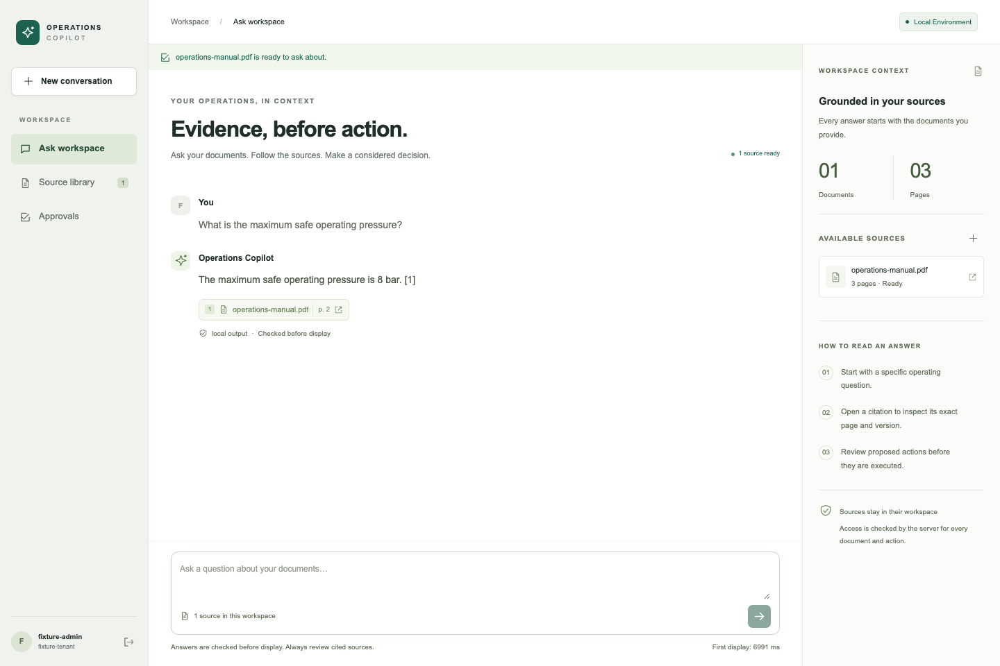

# AI Systems Lab

**A local PDF copilot with traceable answers, durable approvals and inspectable engineering evidence.**

Upload a PDF, ask a question, open the exact source page and review a proposed action
before it executes. The project brings retrieval, identity, output validation, evaluation
and recovery together in one working application.



*Actual Qwen local-model browser run on clean `10e53e8`, 30 September 2026.
[Current verification](docs/FUNCTIONAL_VERIFICATION.md) records the application and CI results.*

This is an independent, AI-assisted engineering portfolio. It demonstrates a local
application and 18 related modules or experiments. Production acceptance remains
incomplete. Start with the [redteam review](docs/REDTEAM.md), then inspect the
[publication verification](docs/PUBLICATION.md), [historical measured report](docs/VERIFICATION.md)
and [criterion ledger](docs/PROJECT_LEDGER.md).

## What to inspect first

| Capability | Implementation | Failure behavior |
|---|---|---|
| Versioned PDF retrieval | [RAG](packages/pais/rag.py), [vector adapters](packages/pais/retrieval.py) | Tenant filtering, source version retention, malformed/scanned input handling and invalid citation rejection. |
| Checked answers and source pages | [API](services/api/app.py), [Next.js UI](apps/copilot) | Required output validation before delivery, inert rendering of model text, cancellation and retry reconciliation. |
| Durable human approval | [Workflow](packages/pais/workflows.py) | Reviewer, action hash, source version and expiry are rechecked; local effects use durable replay handling. |
| Regression and release evidence | [Evaluation](packages/pais/evaluation.py), [release binding](packages/pais/operations.py) | Frozen case identities, metrics, thresholds and source provenance are verified; degraded candidates fail. |
| Worker recovery | [Jobs](packages/pais/jobs.py), [memory](packages/pais/memory.py) | Real Redis/Celery restart tests, explicit uncertain/dead states, correction and deletion markers. |

The [architecture](docs/ARCHITECTURE.md) explains state ownership and trust boundaries.
[Shared contracts](docs/CONTRACTS.md) describe identity, citations, usage, approvals and jobs.

## Try the PDF demo

Use **Python 3.12 and uv**. The complete native test suite requires **Linux**; the
fixture application was also reproduced on macOS/ARM as recorded in the publication report.
The full test suite also needs
`redis-server` on `PATH`; the UI needs **Node.js 24**. No model download is required for
the fixture demo. Fixture responses are deterministic and visibly labelled.

```bash
git clone https://github.com/builtbyhuy/production-ai-systems.git
cd production-ai-systems
uv sync --frozen --group dev --extra vectors --extra router --extra workflows
uv run --no-sync pais setup --profile fixture
uv run --no-sync pais demo 01 --profile fixture
```

To open the application, run the API:

```bash
uv run --no-sync pais dev --profile fixture
```

In a second terminal:

```bash
cd apps/copilot
npm ci
npm run build
npm run start
```

Open [http://127.0.0.1:3000](http://127.0.0.1:3000), choose **Open fixture workspace**,
upload a text PDF, ask a question and open its citation. The
[UI guide](projects/08-streaming-ui/README.md) documents credentials, approval and recovery.
For actual local generation, embeddings and reranking, follow
[local-model provisioning](projects/07-local-first/README.md).

Once those small models are provisioned and locked, install the complete local runtime:

```bash
uv run --no-sync pais setup --profile local
```

Start the native Ollama server in the repository root, using the same model store as
provisioning (keep this terminal open):

```bash
OLLAMA_HOST=127.0.0.1:11434 OLLAMA_MODELS="$PWD/models/ollama" OLLAMA_NO_CLOUD=1 OLLAMA_CONTEXT_LENGTH=2048 ollama serve
```

In another terminal, start the API; the frontend commands above stay the same:

```bash
PAIS_ALLOW_FIXTURE_AUTH=1 uv run --no-sync pais dev --profile local
```

Choose **Open local test workspace**. The CLI selects the isolated Guardrails validator
and standard model lock; explicit environment settings take precedence. Test identities
are restricted to the opted-in development workspace. Answers use the actual local model
and never fall back to fixture responses.

## Verify the behavior

```bash
uv sync --frozen --project projects/04-eval-harness
uv run --no-sync pytest tests projects/13-agent-memory/test_comparison.py projects/14-inference-server/test_supervisor.py -q
uv run --no-sync pais eval --profile fixture --suite release
uv run --no-sync pais eval --profile fixture --suite release --degraded
```

The deliberately degraded evaluation must exit **1**. An unavailable prerequisite exits
**2** and cannot count as an expected quality rejection. See the
[evaluation contract](evals/README.md) and [CI workflow](.github/workflows/ci.yml).
The [redteam report](docs/REDTEAM.md) records independently reproduced checks and fixes.

## Evidence and limits

The original clean application commit `c7b8a79` passed 262 Python checks, 14 fixture
browser cases and one actual local-model browser flow. Its local regression suite passed
144/144; the deliberately degraded run failed 48 cases. Historical reports retain their
own tested commits and do not authorize a newer release.

That local suite contained **56 Qwen responses, 16 deterministic excerpt summaries and
72 contract/abstention cases**. It is a synthetic regression workload. Ordinary answers
select complete source sentences; summaries assemble disclosed excerpts. Exact page/span
checks do not establish arbitrary paraphrase entailment or broad-domain model quality.

Other experiments expose useful failures: routing did not improve over the cheap model;
hybrid recall@1 fell to 0.21 at 10,000 synthetic documents; tiny SFT/DPO models achieved
0% held-out exact match. Hostile-code execution stays disabled, vLLM serving did not start,
and external SaaS, cluster and upstream submission criteria remain unfinished.
Current dependency remediation is tracked in [the audit](docs/dependencies/AUDIT.md). The
[verification report](docs/VERIFICATION.md) preserves these results and remaining work.

## Explore the lab

| Area | Modules |
|---|---|
| Application and retrieval | [01 RAG](projects/01-rag-citations/README.md), [07 local-first](projects/07-local-first/README.md), [08 UI](projects/08-streaming-ui/README.md), [12 vector search](projects/12-vector-database/README.md) |
| Reliability and control | [02 routing](projects/02-model-router/README.md), [04 evaluation](projects/04-eval-harness/README.md), [05 observability](projects/05-observability/README.md), [06 security](projects/06-security-guardrails/README.md), [15 approval](projects/15-human-approval/README.md), [16 automation](projects/16-automation-pipeline/README.md) |
| Agent and model experiments | [03 research](projects/03-multi-agent-research/README.md), [09 training](projects/09-lora-training/README.md), [13 memory](projects/13-agent-memory/README.md), [14 inference](projects/14-inference-server/README.md), [17 benchmark](projects/17-domain-benchmark/README.md) |
| Integration and delivery | [10 tenant SaaS](projects/10-multi-tenant-saas/README.md), [11 CI/CD](projects/11-cicd/README.md), [18 prepared upstream patch](projects/18-upstream-contribution/README.md) |

Each module has a demo, acceptance scope, evidence and a next action. The original scope is
in [BUILD_SPEC.md](docs/BUILD_SPEC.md). Read [AGENTS.md](AGENTS.md) and [STATE.md](STATE.md)
before continuing development. Use this directory as the workspace root.

Original code and synthetic corpora use [MIT](LICENSE). Models and dependencies retain
their own licenses. Selected reviewed evidence snapshots are included; large runtime logs,
model weights, databases, browser binaries and installed dependencies remain excluded.
